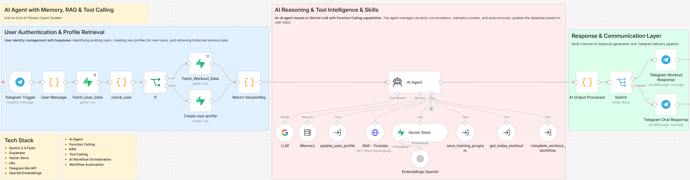

# AI Fitness Coach Agent

An AI-powered fitness coach agent built with n8n, Gemini, Telegram Bot API, Supabase, and RAG.

The system acts as a personal fitness assistant that can onboard users, remember their profile, generate personalized workout plans, retrieve exercise knowledge from a vector database, save training programs, show today's workout, and update workout progress.

## Features

- Telegram-based fitness chatbot
- AI Agent with tool calling
- User onboarding and profile memory
- Supabase database integration
- RAG workflow using Supabase Vector Store
- Personalized workout plan generation
- Save and retrieve training programs
- Mark completed workouts and move to the next day
- Modular n8n workflows

## Architecture

## Tech Stack

- n8n
- Google Gemini
- Telegram Bot API
- Supabase
- Supabase Vector Store
- OpenAI Embeddings
- JavaScript Code Nodes

## Workflows

The project includes several n8n workflows:

- `AI_trainer.json`  
  Main AI agent workflow

- `RAG.json`  
  Loads exercise knowledge into the vector database

- `update_user_profile_workflow.json`  
  Updates user profile data such as goal, level, injuries, equipment, and weekly training frequency

- `save_training_program_workflow.json`  
  Saves a generated training program into Supabase

- `get_today_workout_workflow.json`  
  Retrieves the user's current workout day

- `complete_workout_workflow.json`  
  Marks the current workout as completed and moves the user to the next workout day

## Project Goal

The goal of this project is to demonstrate how a modern AI agent can combine:

- Long-term memory
- Structured user data
- External tools
- RAG
- Workflow automation
- Real-time chat interaction

This project was built as a portfolio project to explore practical AI agent architecture using n8n.

## Security Notice

All credentials, API keys, personal user IDs, and private test data were removed from the exported workflows before publishing.

To run this project, you need to configure your own:

- Telegram Bot credentials
- Supabase credentials
- Gemini / LLM credentials
- OpenAI Embeddings credentials
- Supabase tables and vector database

## Database

This project uses Supabase tables for:

- User profiles
- Training programs
- Program days
- Exercise knowledge for RAG
